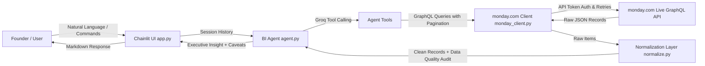

# 📊 Founder BI Agent for monday.com

A conversational Business Intelligence AI agent powered by **Chainlit** and **Groq** (default: `llama-3.3-70b-versatile`) with function-calling. It connects directly to live **monday.com** GraphQL APIs, seamlessly normalizes messy multi-lingual project & sales data, flags data-quality risks, and delivers strategic executive insights to founders at lightning speed.

---

## 🌟 Key Features

1. **Live monday.com GraphQL API Integration**:
   - Direct HTTP queries against `https://api.monday.com/v2` (no CSV or static caching).
   - Dynamic schema introspection: automatically inspects board columns, types, and labels.
   - Cursor-based pagination (`next_items_page`) to fetch boards of arbitrary size.
   - Exponential backoff & retry mechanism to handle rate limits (HTTP 429) and transient errors.

2. **Messy Real-World Data Normalization Layer**:
   - **Multi-lingual Date Parsing**: Handles mixed formats, relative dates, ordinal dates, and abbreviations in English, Portuguese, Spanish (e.g., `Jan`, `fev`, `March 3rd 2026`, `03/03/26`, `15 de março de 2026`, `dez 2025`).
   - **Categorical Canonicalization**: Cleans and clusters noisy sector names (`Energy`, `energy sector`, `ENERGY ` → `Energy`) and stages (`Closed Won`, `Won`, `Deal Won` → `Won`).
   - **Numeric & Currency Extraction**: Normalizes strings like `$50,000`, `50k`, `1.5M` into standard floats.
   - **Data Quality Reporter**: Tracks null counts, malformed entries, and provides contextual caveat disclosures so founders are never misled by incomplete data.

3. **Tool-Calling Reasoning Agent Powered by Groq**:
   - Ultra-fast token generation and low latency powered by Groq LPUs.
   - Decisive founder-level synthesis with structured breakdowns, conversion rates, and revenue metrics.
   - Cross-board joins correlating Won Deals with Work Order delivery execution.
   - Strictly bounded iteration loop (max turns) for safety and cost control.
   - Contextual data quality alerts included in every answer.

4. **Interactive Chainlit UI & Leadership Updates**:
   - Real-time tool-execution tracking with UI step indicators.
   - Startup health checks showing connected boards and schema mappings.
   - Dedicated `/summary` or `/leadership` command to generate executive-ready markdown reports.

---

## 🏗️ Architecture Overview



---

## 🚀 Getting Started

### 1. Prerequisites
- Python 3.10+ (Python 3.11 recommended)
- A monday.com account with API access
- A Groq API key (`GROQ_API_KEY`) from [console.groq.com](https://console.groq.com)

### 2. Installation

Clone the repository and install dependencies:
```bash
git clone <repo-url>
cd "Skylark _Drones_Assignment"
pip install -r requirements.txt
```

### 3. Setting Up Credentials (.env)

Copy `.env.example` to `.env`:
```bash
cp .env.example .env
```

Fill in your configuration:

#### A. Getting your monday.com API Token:
1. Log into your monday.com account.
2. Click your **Profile Picture** in the bottom left corner.
3. Select **Developers** (or Administration → API).
4. Click **Developer** → **My Access Tokens** and copy your personal API token.
5. Paste it into `MONDAY_API_KEY`.

#### B. Finding Board IDs:
1. Open your **Work Orders** board in your browser.
2. The URL format is `https://yourteam.monday.com/boards/1234567890`.
3. The number `1234567890` is your `WORK_ORDERS_BOARD_ID`.
4. Repeat for your **Deals** board to get `DEALS_BOARD_ID`.

#### C. Groq API Keys (Primary & Fallback):
Get your free API key at [console.groq.com/keys](https://console.groq.com/keys) and set `GROQ_API_KEY`. You can also set a fallback `GROQ_API_KEY2` which the agent will automatically switch to if the primary key experiences rate limits or API errors.

Example `.env`:
```ini
MONDAY_API_KEY=eyJhbGciOi...
WORK_ORDERS_BOARD_ID=8123456789
DEALS_BOARD_ID=8123456790
GROQ_API_KEY=gsk_...
GROQ_API_KEY2=gsk_... # Optional fallback key
# Optional model override (default: llama-3.3-70b-versatile)
# GROQ_MODEL=llama-3.3-70b-versatile
```

---

## 🧪 Diagnostics & Validation

Run the diagnostic script to verify credentials, inspect board schemas, and test Groq API connectivity:
```bash
python test_connection.py
```

Run automated unit tests for date normalization, sector clustering, and agent tools:
```bash
python -m pytest test_suite.py
```

---

## 💻 Running the Web Application

Start the Chainlit conversational interface with hot-reloading:
```bash
chainlit run app.py -w
```
Open your browser at `http://localhost:8000`.

---

## 💬 Sample Queries

- **Pipeline Analysis**: *"What is our total active pipeline across all sectors?"*
- **Execution & Delivery**: *"How many work orders are delayed or at risk, and for which clients?"*
- **Cross-Board Join**: *"Are our won deals being delivered on schedule by operations?"*
- **Data Quality Audit**: *"What data gaps, missing close dates, or null values exist in our boards?"*
- **Executive Update**: Type `/summary` or `/leadership` to generate a complete founder update.

---

## 🌐 Cloud Deployment

### Deploy on Render (using `render.yaml`)
1. Push this repository to GitHub.
2. Log into [Render](https://render.com) and click **New +** → **Blueprint**.
3. Connect your repository. Render will automatically detect `render.yaml`.
4. Add your secret environment variables (`MONDAY_API_KEY`, `WORK_ORDERS_BOARD_ID`, `DEALS_BOARD_ID`, `GROQ_API_KEY`) in the Render dashboard.

### Deploy with Docker
```bash
docker build -t monday-bi-agent .
docker run -p 8000:8000 --env-file .env monday-bi-agent
```

---

## 📂 Project Structure

```
├── app.py               # Chainlit web application & session management
├── agent.py             # Tool-calling agent logic & executive prompt engine
├── monday_client.py     # Live monday.com GraphQL client with pagination & retries
├── normalize.py         # Multi-language date parser, sector cleaner, & data quality audit
├── test_connection.py   # CLI diagnostic tool for connection & schema inspection
├── test_suite.py        # Automated test suite
├── requirements.txt     # Python dependencies
├── Dockerfile           # Production container configuration
├── render.yaml          # Render deployment blueprint
├── DECISION_LOG.md      # Architectural trade-offs & design decisions
└── README.md            # Comprehensive documentation
```
